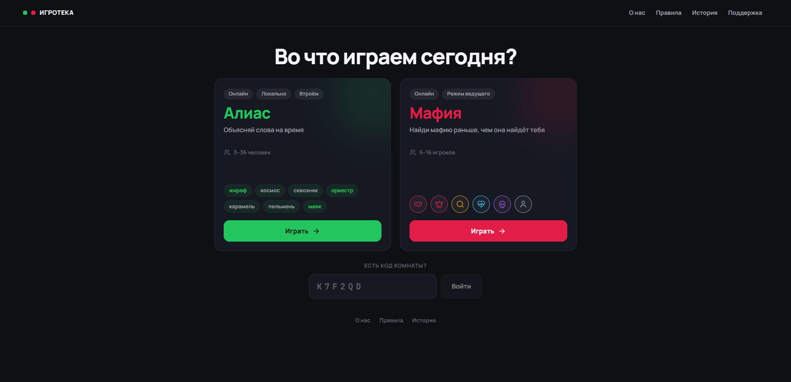
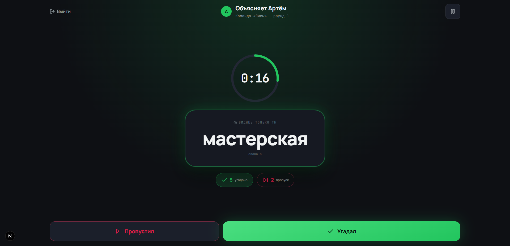
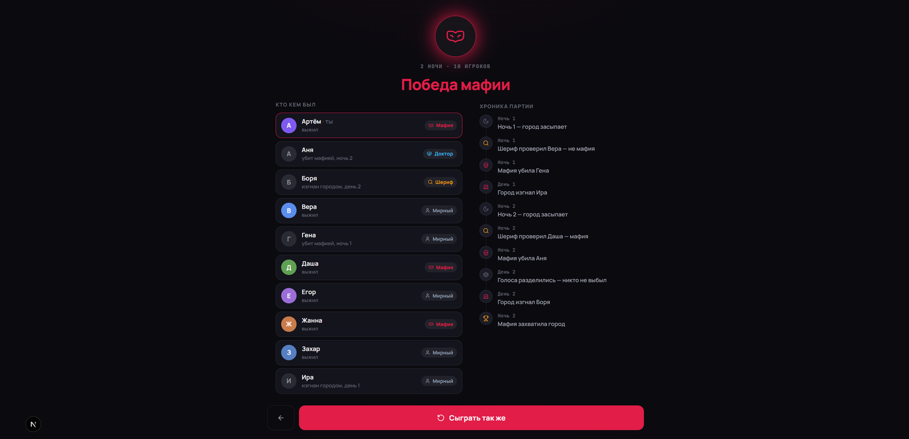

<div align="center">

# Игротека

**Алиас и Мафия — две многопользовательские игры для компании, в браузере, без установки и регистрации**

Серверная игровая логика · защита от подглядывания · переживает перезапуск · разворачивается одной командой


</div>

<!--
  Скриншоты. Положить файлы в project-context/screenshots/ под этими именами —
  и блок оживёт. Что снимать, написано в project-context/screenshots/README.md.
-->
<div align="center">

| | |
|---|---|
|  |  |
| Хаб: выбор игры и вход по коду | Алиас: слово видит только объясняющий |
|  |  |
| Мафия: ночь, ход мафии | Итоги: кто кем был и хроника ночей |

</div>

---

## О проекте

Настольные игры лежат в коробках, а компания собирается там, где коробки нет.
Игротека заменяет коробку: слова, роли, таймер и подсчёт очков берёт на себя
сайт, от игроков нужны только телефоны и ссылка. В Мафии он заодно работает за
ведущего — раздаёт роли и сам ведёт ночь, вслух и по шагам, так что за столом не
остаётся человека, который весь вечер только объявляет.

С инженерной стороны это две игры реального времени с общим каркасом. Главная
сложность здесь не в интерфейсе, а в том, что **состояние игры нельзя доверить
клиенту**: в Мафии знание чужой роли обесценивает партию целиком, а в Алиасе
слово не должно попасть на экран угадывающих. Поэтому фазы, таймеры и роли
считает сервер, а каждому игроку уходит свой собственный, урезанный вид
состояния — не «скрытый интерфейсом», а физически не содержащий чужих секретов.

---

## Чем интересен технически

**Приватность на уровне протокола, а не интерфейса.**
Полный расклад ролей не покидает сервер никогда. На каждый сокет собирается
персональный `MafiaView`, где чужих ролей нет в данных. Тесты проверяют
сериализованный ответ, а не типы: TypeScript пропустит лишнее поле в объекте,
который потом уйдёт в JSON.

**Партии переживают перезапуск сервера.**
Дедлайн таймера дублируется в снимке комнаты. Каждый деплой перезапускает ws —
при следующем подключении таймер заводится на остаток, а просроченная фаза
доигрывается сразу. Комната не зависает.

**Утечка через тишину — и три приёма против неё.**
В режиме ведущего наивная реализация не зовёт ночью мёртвую роль, и все за
столом слышат, что доктор погиб, ещё до объявления. План ночи строится из
настроек, а не из живых; шаг мёртвой роли длится случайное время; остаток
таймера скрыт от всех, кроме ходящего.

**Один типизированный контракт на два процесса.**
web и ws — разные образы, но типы событий импортируют из общего пакета. Клиент
физически не может послать событие в формате, которого сервер не ждёт: проект
не соберётся.

**Две базы под две природы состояния.**
Redis держит идущую комнату — фазу, таймер, роли, голоса. Postgres хранит то,
что должно пережить перезагрузку. Граница проходит по вопросу «переживёт ли это
перезапуск», а TTL решает уборку бесплатно.

**Тесты, которые ловят межпроцессные баги.**
244 юнит-теста плюс 13 smoke-сценариев на настоящих сокет-соединениях: они
играют партию целиком вместо ручного прогона в шести вкладках. Один такой
поймал баг, из-за которого вторая партия в комнате молча не сохранялась.

Подробный разбор каждого решения — в
[**ENGINEERING.md**](project-context/ENGINEERING.md).

---

## Стек

| Слой | Технологии |
|---|---|
| **Фронтенд** | Next.js 16 (App Router) · React 19 · React Compiler · TypeScript 5 |
| **Стили** | Tailwind CSS 4 · собственная система токенов · `lucide-react` |
| **Реалтайм** | Socket.io 4 |
| **Базы** | PostgreSQL 16 · Redis 7 |
| **ORM** | Prisma 6 |
| **Речь** | Web Speech API — голос устройства, без внешних сервисов |
| **Инфраструктура** | Docker Compose · Caddy · npm workspaces |
| **Качество** | строгий TypeScript · ESLint · Vitest · smoke-сценарии |

---

## Архитектура

```
                        Браузер
                           │
                       HTTPS / WSS
                           │
                  ┌────────▼────────┐
                  │      Caddy      │  TLS, единственный порт наружу
                  └───┬─────────┬───┘
            /socket.io│         │остальное
                  ┌───▼───┐ ┌───▼───┐
                  │  ws   │ │  web  │
                  │Socket.│ │Next.js│
                  │  io   │ │ + API │
                  └───┬───┘ └───┬───┘
                      └────┬────┘
                  ┌────────┴────────┐
            ┌─────▼─────┐    ┌──────▼─────┐
            │ PostgreSQL│    │   Redis    │
            │  история  │    │  комнаты   │
            └───────────┘    └────────────┘
```

| Сервис | Роль | Почему так |
|---|---|---|
| **Caddy** | Прокси и TLS | Сам получает и продлевает сертификат; web и ws на одном домене — CORS не возникает |
| **web** | Страницы + REST `/api/*` | Отдаёт интерфейс и работает с БД |
| **ws** | Постоянные WebSocket-соединения | Отдельный процесс: фронт можно перезапустить, не роняя партии |
| **PostgreSQL** | Долговременные данные | Переживает перезагрузки |
| **Redis** | Состояние идущей комнаты | Фаза, таймер, роли; TTL сутки, у опустевшей комнаты 10 минут |

Порты баз наружу не публикуются — только внутренняя сеть Docker.
Подробнее — в [ARCHITECTURE.md](project-context/ARCHITECTURE.md).

---

## Что умеет

### Алиас

- **Три способа играть:** онлайн (каждый со своего телефона), локально (одно
  устройство по кругу) и втроём — отдельный режим с кругом из шести ходов
- **3–36 человек:** втроём или 2–6 команд по 2–6 игроков, плюс зрители
- **8134 слова:** 8 подборок, 35 тем и 3 уровня сложности; наборы комбинируются,
  а внутри партии слово не повторяется
- **Живой таймер** — отсчёт ведёт сервер, у всех идёт синхронно
- **Экран итогов раунда** — спорные слова правятся до передачи хода

### Мафия

- **6 ролей:** мафия, дон, шериф, доктор, маньяк, мирный; состав считается
  автоматически или задаётся вручную
- **Сервер вместо ведущего** — сам ведёт ночь, утро, обсуждение и голосование
- **Режим ведущего** для игры за одним столом: ночь по шагам, роли просыпаются
  по очереди, сайт проговаривает вслух голосом устройства
- **Голосование** с переголосованием при ничьей и последним словом
- **Зрители** с живой лентой событий, **хроника партии** в финале
- **5–16 игроков**

### Общее

- Вход по шестизначному коду — сервер сам определяет, чья это комната
- История партий обеих игр в одном списке, незавершённую можно доиграть
- Экраны итогов, «сыграть так же», «убрать из своей истории»
- Пауза, переподключение, передача комнаты пропавшего хоста

Полные правила и все числа — в [GAMEPLAY.md](project-context/GAMEPLAY.md).

---

## Структура проекта

```
alias-online/
│
├── apps/
│   ├── web/                          Next.js: страницы и REST API
│   │   ├── src/
│   │   │   ├── app/                  App Router
│   │   │   │   ├── page.tsx          хаб: выбор игры, вход по коду
│   │   │   │   ├── alias/            лендинг, лобби, игра, локальный режим
│   │   │   │   ├── mafia/            лендинг, лобби, игра, итоги
│   │   │   │   ├── history/          история партий обеих игр
│   │   │   │   ├── about/ rules/     о проекте и правила
│   │   │   │   └── api/              15 REST-роутов
│   │   │   ├── components/
│   │   │   │   ├── common/           общее: топбар, QR, диалоги
│   │   │   │   ├── platform/         каркас страниц-документов
│   │   │   │   ├── alias/            экраны Алиаса
│   │   │   │   └── mafia/            экраны Мафии
│   │   │   ├── hooks/                клиентские машины состояний
│   │   │   │                         useRoom · useMafiaRoom · useTimer
│   │   │   │                         useNarrator · useVoices
│   │   │   ├── lib/                  prisma · redis · токены · снимки
│   │   │   │                         aid-cookie · rate-limit · history-access
│   │   │   ├── constants/            лимиты и витрина словаря
│   │   │   └── proxy.ts              middleware: подписанная кука aid
│   │   └── tests/                    10 файлов, jsdom
│   │
│   └── ws/                           Socket.io: реалтайм обеих игр
│       ├── src/
│       │   ├── index.ts              неймспейсы /room и /mafia
│       │   ├── auth.ts               проверка WS-токена
│       │   ├── lib/                  дебаунс рассылки
│       │   ├── services/             уборка брошенных комнат
│       │   └── games/
│       │       ├── alias/            лобби, раунд, очки, слова
│       │       └── mafia/            engine · engine-core · view · роли
│       ├── scripts/                  13 smoke-сценариев
│       └── tests/                    юнит-тесты движка
│
├── packages/shared/                  общее для web и ws
│   ├── src/
│   │   ├── domain.ts                 типы Алиаса
│   │   ├── mafia.ts                  типы Мафии
│   │   ├── trio.ts                   круг из шести ходов
│   │   ├── mafia-narration.ts        реплики ведущего
│   │   ├── token.ts                  подпись WS-токенов
│   │   ├── constants.ts              лимиты и правила
│   │   └── server/                   клиенты БД, снимки в Redis
│   └── tests/
│
├── prisma/
│   ├── schema.prisma                 17 моделей
│   ├── migrations/                   9 миграций
│   ├── data/alias-catalog.json       словарь: 8134 слова
│   └── seed.ts
│
├── project-context/                  документация
├── scripts/                          импорт словаря
│
├── docker-compose.yml                локальные базы
├── docker-compose.prod.yml           весь прод: 5 контейнеров
├── Caddyfile                         реверс-прокси и TLS
└── deploy.sh                         обновление на сервере
```

---

## Быстрый старт

```bash
npm install
cp .env.example .env
npm run setup:local   # базы в Docker + миграции + словарь
npm run dev           # web :3000 + ws :3001
```

Открыть **http://localhost:3000**. Нужны Node 22+ и запущенный Docker Desktop.

Подробно, включая игру с телефона по локальной сети и разбор частых ошибок, —
в [GETTING-STARTED.md](project-context/GETTING-STARTED.md).

---

## Команды

| Команда | Назначение |
|---|---|
| `npm run dev` | web и ws одновременно |
| `npm run build` | прод-сборка |
| `npm run check` | типы + линт + тесты — полная проверка |
| `npm test` | только тесты |
| `npm run lint` | ESLint |
| `npm run typecheck` | `tsc --noEmit` по всем пакетам |
| `npm run setup:local` | базы + миграции + словарь одной командой |
| `npm run db:up` / `db:down` | поднять и остановить локальные базы |
| `npm run db:migrate` | создать миграцию |
| `npm run db:seed` | залить словарь |
| `npm run db:studio` | Prisma Studio |
| `npm run smoke:game -w @alias/ws` | полный раунд Алиаса на живых сокетах |
| `npm run smoke:mafia -w @alias/ws` | партия Мафии на 6 клиентов |
| `npm run smoke:narrator -w @alias/ws` | режим ведущего: ночь по шагам |

Всего smoke-сценариев 13, полный список — в
[TESTING.md](project-context/TESTING.md).

---

## Документация

- [**ENGINEERING.md**](project-context/ENGINEERING.md) — инженерные решения:
  задача, варианты и цена выбора по каждому.
- [**ARCHITECTURE.md**](project-context/ARCHITECTURE.md) — устройство проекта,
  монорепо, реалтайм, данные, где что лежит.
- [**GAMEPLAY.md**](project-context/GAMEPLAY.md) — полные правила обеих игр и
  все параметры: лимиты, роли, таймеры, словарь.
- [**SECURITY.md**](project-context/SECURITY.md) — модель угроз, приватность
  ролей, подпись куки и токенов, что осознанно не сделано.
- [**TESTING.md**](project-context/TESTING.md) — как устроены оба набора тестов
  и что проверяет каждый smoke-сценарий.
- [**GETTING-STARTED.md**](project-context/GETTING-STARTED.md) — запуск
  локально, переменные окружения, игра с телефона, частые ошибки.
- [**DEPLOYMENT.md**](project-context/DEPLOYMENT.md) — разворачивание на VPS,
  Docker Compose, Caddy и TLS, обновление, бэкапы.

---

## Качество

- **244 теста в 29 файлах** — серверная логика в node, хуки и экраны в jsdom
- **13 smoke-сценариев** на настоящих сокет-соединениях
- **Строгий TypeScript** без `any` в игровой логике, общие типы на клиент и сервер
- **`npm run check`** — типы, линт и тесты одной командой перед коммитом
