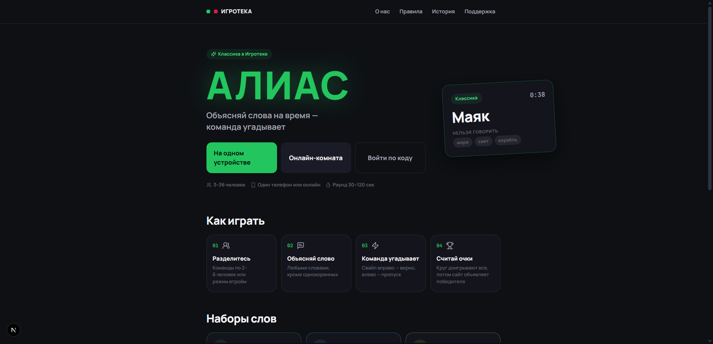

<div align="center">

# Игротека

**Алиас и Мафия — две многопользовательские игры для компании, в браузере, без установки и регистрации**

<!-- ССЫЛКА: сюда встанет адрес живого сайта, когда он появится -->


</div>

<div align="center">

<!--
  Размер задан у картинок, а не у колонок: в markdown-таблице ширину колонок
  браузер раздаёт сам, по длине подписей, и одинаковые файлы отрисовывались
  разными. Все снимки 1920×928, поэтому 420×203 — это ровно их пропорция,
  ничего не сплющивается.
-->
| | |
|---|---|
|  |  |
| **Хаб** — выбор игры и вход по коду | **Алиас** — с чего начать и как играть |
|  |  |
| **Раунд Алиаса** — слово видит только объясняющий | **Итоги Мафии** — кто кем был и хроника партии |

</div>

**Стек:** Next.js 16 (App Router) · React 19 · TypeScript 5 · Socket.io 4 ·
PostgreSQL 16 · Redis 7 · Prisma 6 · Tailwind CSS 4 · Docker Compose · Caddy ·
npm workspaces · Vitest.

---

## Ключевые инженерные решения

**Приватность на уровне протокола, а не интерфейса.**
Полный расклад ролей не покидает сервер никогда: на каждый сокет собирается
персональный `MafiaView`, где чужих ролей нет в данных — не «скрыты вёрсткой», а
физически отсутствуют. Тесты проверяют сериализованный ответ, а не типы:
TypeScript пропустит лишнее поле в объекте, который потом уйдёт в JSON, и
единственная надёжная проверка — посмотреть, что реально улетело клиенту.

**Партии переживают перезапуск сервера.**
Дедлайн таймера живёт не в памяти процесса, а дублируется в снимке комнаты в
Redis. Каждый деплой перезапускает ws — при следующем подключении таймер
заводится на остаток, а фаза, срок которой истёк, пока сервера не было,
доигрывается сразу. Комната не зависает и не требует ручного вмешательства.

**Утечка через тишину — и три приёма против неё.**
В режиме ведущего за одним столом наивная реализация просто не зовёт ночью
мёртвую роль, и вся компания на слух понимает, что доктор погиб, ещё до
объявления. Поэтому план ночи строится из настроек партии, а не из списка живых;
шаг мёртвой роли длится случайное время; остаток таймера видит только тот, чей
сейчас ход.

**Один типизированный контракт на два процесса.**
web и ws — разные образы и разные рантаймы, но типы событий оба импортируют из
общего пакета `@igroteka/shared`. Клиент физически не может послать событие в
формате, которого сервер не ждёт: проект просто не соберётся. Это же снимает
целый класс багов «фронт шлёт одно, сервер ждёт другое», ради которых обычно
держат схемы и кодогенерацию.

**Две базы под две природы состояния.**
Redis держит идущую комнату — фазу, таймер, роли, голоса; Postgres хранит то,
что должно пережить перезагрузку. Граница проходит ровно по вопросу «переживёт
ли это перезапуск», и благодаря ей уборка брошенных комнат достаётся почти
бесплатно: TTL снимает их сам, а фоновой задаче остаётся закрыть строку в
Postgres.

**Тесты, которые ловят межпроцессные баги.**
316 юнит-тестов плюс 16 smoke-сценариев, играющих партию целиком на настоящих
сокет-соединениях, — вместо ручного прогона в шести вкладках. Один такой поймал
баг, из-за которого вторая партия в одной и той же комнате молча не
сохранялась: юнит-тестами он не ловился в принципе, потому что жил на стыке
двух процессов.

Разбор каждого решения — задача, варианты, цена выбора — в
[**ENGINEERING.md**](project-context/ENGINEERING.md).

---

## Документация

- [**ENGINEERING.md**](project-context/ENGINEERING.md) — инженерные решения:
  задача, варианты и цена выбора по каждому.
- [**ARCHITECTURE.md**](project-context/ARCHITECTURE.md) — устройство проекта:
  монорепо, реалтайм, данные, где что лежит.
- [**GAMEPLAY.md**](project-context/GAMEPLAY.md) — полные правила обеих игр и
  все параметры: лимиты, роли, таймеры, словарь.
- [**SECURITY.md**](project-context/SECURITY.md) — модель угроз, приватность
  ролей, подпись куки и токенов, что осознанно не сделано.
- [**TESTING.md**](project-context/TESTING.md) — как устроены оба набора тестов
  и что проверяет каждый smoke-сценарий.
- [**GETTING-STARTED.md**](project-context/GETTING-STARTED.md) — запуск
  локально, переменные окружения, игра с телефона, частые ошибки.
- [**DEPLOYMENT.md**](project-context/DEPLOYMENT.md) — разворачивание на VPS,
  Docker Compose, Caddy и TLS, обновление, бэкапы.

---

## Быстрый старт

```bash
npm install
cp .env.example .env
npm run setup:local   # клиент Prisma + базы в Docker + миграции + словарь
npm run dev           # web :3000 + ws :3001
```

Открыть **http://localhost:3000**. Нужны Node 22+ и запущенный Docker Desktop.

Подробно — игра с телефона по локальной сети, переменные окружения, разбор
частых ошибок — в [GETTING-STARTED.md](project-context/GETTING-STARTED.md).

---

## Об этом репозитории

Это публичное зеркало исходного кода. В него намеренно не входят словарь игры —
8134 слова, собранные и размеченные вручную, — и продакшен-конфигурация. Вместо
полного словаря в репозитории лежит демонстрационный набор
`prisma/data/alias-catalog.sample.json`: три подборки, три темы, три уровня
сложности по двадцать слов. Проект на нём разворачивается и играется, просто
слова заканчиваются быстрее.

## Лицензия

Код опубликован для ознакомления и оценки. Копирование, распространение,
изменение и коммерческое использование — только с письменного разрешения
автора; подробности в [LICENSE](LICENSE).
